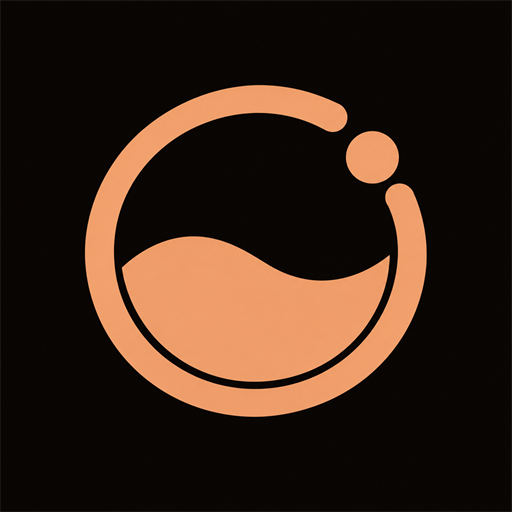
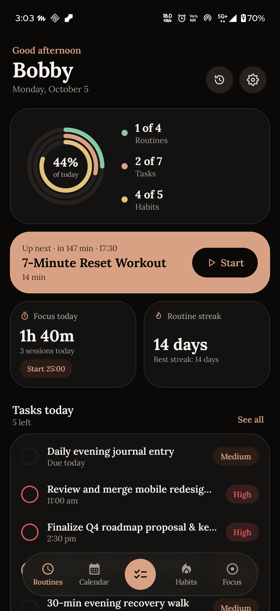
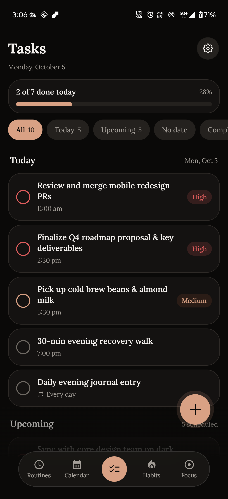
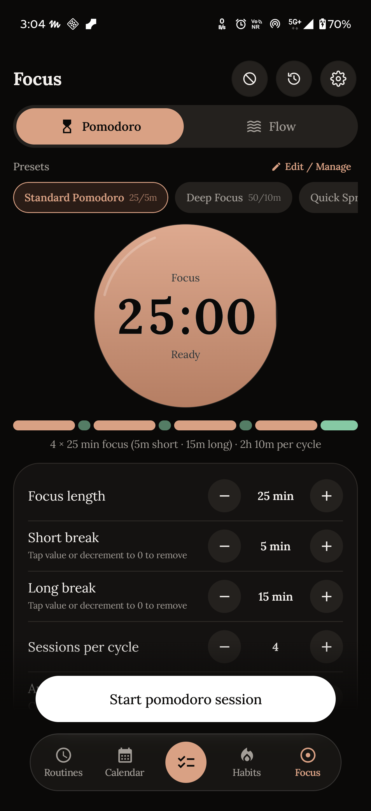
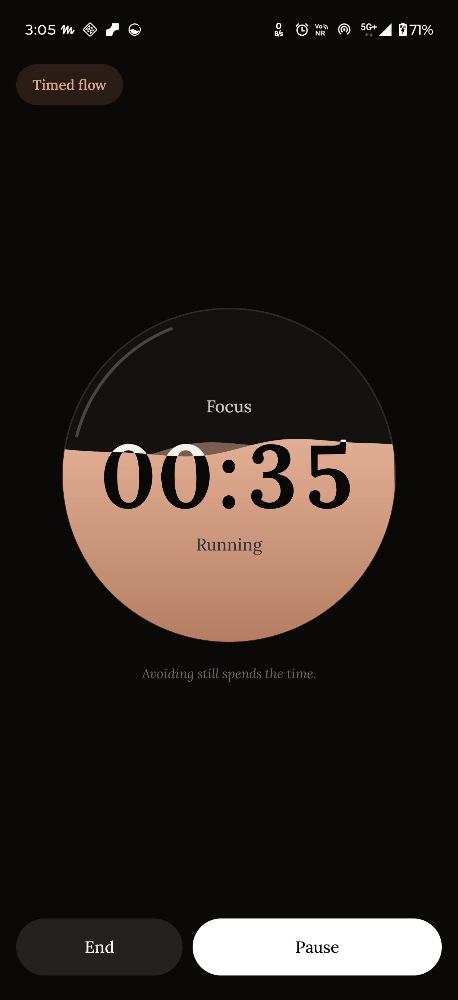
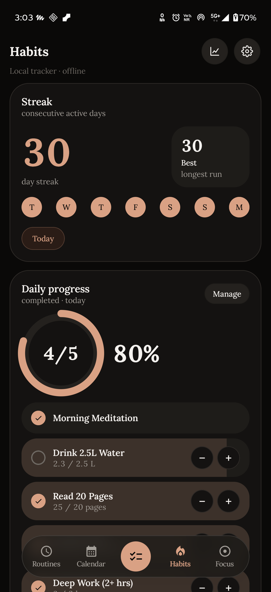
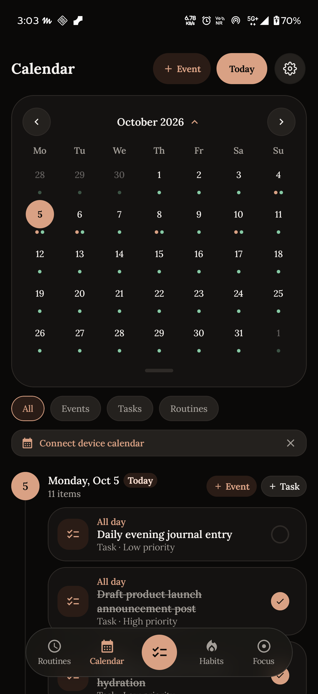

<div align="center">
  

  # Reflex

  **Routines, habits, tasks and deep focus, in one calm app that never leaves your phone.**

  <p>
    <a href="https://github.com/bobby-99/reflex/releases/latest"></a>
    <a href="LICENSE"></a>
    
    
  </p>

  <p>
    <a href="https://ko-fi.com/P5X2288QK6"></a>
  </p>

  <!-- After the F-Droid merge request is accepted, replace the badge below with:
  [](https://f-droid.org/packages/com.reflex.productivity)
  -->

  <p>
    <a href="#-features">Features</a> ·
    <a href="#-screenshots">Screenshots</a> ·
    <a href="#-install">Install</a> ·
    <a href="#-privacy-by-design">Privacy</a> ·
    <a href="#-build-from-source">Build</a> ·
    <a href="#-contributing">Contribute</a> ·
    <a href="#-support-reflex">Support</a>
  </p>
</div>

---

## Why Reflex

Most productivity apps want an account, a subscription and your data. Reflex wants none of them.

It is a timer-driven routine runner, habit tracker, task manager and focus companion that works **100% offline**. Everything lives in a local database on your device, and you can export it any time as a plain JSON file.

| | |
| :--- | :--- |
| 🚫 **No accounts** | No sign-in, no cloud |
| 📡 **No network** | The `INTERNET` permission is not declared |
| 🕵️ **No tracking** | No analytics, ads or trackers |
| 📦 **Portable** | One-tap JSON export and import |

It is also built to be pleasant to look at: warm paper in light mode, obsidian in dark, a single copper accent, bundled Lora typography and soft, rounded surfaces.

---

## 📸 Screenshots

<div align="center">
  <table>
    <tr>
      <td align="center"><br><sub>Routines</sub></td>
      <td align="center"><br><sub>Tasks</sub></td>
      <td align="center"><br><sub>Focus</sub></td>
    </tr>
    <tr>
      <td align="center"><br><sub>Focus analytics</sub></td>
      <td align="center"><br><sub>Habits</sub></td>
      <td align="center"><br><sub>Calendar</sub></td>
    </tr>
  </table>
</div>

---

## ✨ Features

<details open>
<summary><b>🔁 Routines</b>: build sequential steps and let Reflex run them</summary>

- Three step types: **Timed**, **Check-off** and **Repeat-count**, with an optional 10 to 30 second rest between steps and a "Skip rest" button
- Audio and haptic cues, keep-screen-on while running, and a foreground service so a timer survives leaving the app
- Drag-and-drop step reordering
- Starter templates: *Morning Routine*, *Night Wind-Down*, *Focus Pomodoro*, *7-Minute Workout* and *Daily Reset*
- Schedule-aware streaks with a one-day grace period ("completed late"), a "Skip today" option and a four-state heatmap: *on time*, *late*, *skipped*, *missed*

</details>

<details open>
<summary><b>✅ Tasks</b>: due dates, recurrence and natural-language capture</summary>

- Due dates and times, notes, priorities (none, low, medium, high) and full recurrence (daily, weekly, monthly, yearly, custom), counted from the due date or from completion
- Filters with live counts: *All*, *Today*, *Upcoming*, *No date*, *Completed*
- Swipe right to complete, swipe left to delete, with undo
- Natural-language Quick Add that parses dates, times, priorities and repeats as you type, with live highlighting (see the [syntax](#-quick-add-syntax) below)
- Priority alerts for medium and high tasks: a floating card over any app and a lock-screen alert with Mark done, Open and snooze chips (5 min, 10 min, 15 min, 30 min, 1 hour, Tomorrow)

</details>

<details open>
<summary><b>🌱 Habits</b>: schedules, rings and streaks</summary>

- Daily, weekdays, weekends or specific days, with an optional daily reminder
- Completion rings, a Monday to Sunday week view, and current and best streaks that respect each habit's schedule
- A bundled [OpenMoji](https://openmoji.org/) emoji picker organized by *Wellness*, *Exercise*, *Mind*, *Nutrition* and *Productivity*

</details>

<details open>
<summary><b>🎯 Focus</b>: Pomodoro, flow modes and app blocking</summary>

- Classic Pomodoro (25 / 5 / 15 over four cycles, fully adjustable), Timed Flow (15 to 120 minutes) and Open Flow (count up, no target)
- A liquid hero timer, a cycle strip, optional auto-start for breaks, and a link to the task you are working on
- App blocking during focus phases, with a "Back to focus" overlay. It pauses on breaks and always lets Phone, Messages and system settings through
- Focus analytics: a daily goal ring, week, month and year charts, a 365-day consistency heatmap, time-of-day and session-type breakdowns, and your top tasks

</details>

<details open>
<summary><b>📅 Calendar</b>: one agenda for everything</summary>

- An agenda timeline that hides empty days, a compact week strip and an expandable month grid
- Tasks, routines and (optionally) your device calendars side by side, color-coded and configurable (look-ahead window, first day of the week, what to include)

</details>

<details open>
<summary><b>⚙️ Settings, backup and reliability</b></summary>

- System, Dark and Light themes with a smooth switcher
- Live permission diagnostics that tell you exactly what is granted and take you straight to the right system page
- One-tap JSON export and import of routines, tasks, habits, focus history, your profile and your preferences
- Reminders use the system alarm-clock API, so they keep firing under Doze, and they are restored after a reboot or an app update
- A replayable onboarding tour and a built-in way to send feedback

</details>

---

## ⌨️ Quick Add syntax

Type naturally. Reflex pulls out what it understands and keeps the rest as the title.

| You type | Meaning |
| :--- | :--- |
| `today`, `tmrw`, `tonight`, `next week`, `in 5 days` | Relative dates |
| `5pm`, `17:30`, `morning`, `noon`, `eod`, `midnight` | Times and times of day |
| `in 45 mins`, `in 1hr 4min` | Relative durations |
| `!!!` · `p1` · `urgent` · `asap` | High priority |
| `!!` · `p2` | Medium priority |
| `!` · `p3` | Low priority |
| `every tuesday`, `every 2 weeks`, `repeat every weekday` | Recurrence |

**Examples**

```text
Submit report tmrw 5pm !!!
Standup every tuesday 9am
Water plants every 2 weeks
Stretch in 45 mins
```

---

## 🔒 Privacy by design

- **No network access.** The app does not declare the `INTERNET` permission, so it physically cannot send your data anywhere.
- **No accounts, no analytics, no ads, no trackers.**
- **Your data is yours.** It lives in a local database. Android's cloud backup is turned off, and export files are plain JSON you control (they are not encrypted, so store them somewhere you trust).
- **Feedback is opt-in.** The feedback rows just open your own email app with a pre-filled message you can edit before sending.

Read the full statement in [PRIVACY.md](PRIVACY.md).

---

## 📲 Install

| Source | Notes |
| :--- | :--- |
| [GitHub Releases](https://github.com/bobby-99/reflex/releases/latest) | Download `Reflex-vX.Y.Z.apk` and `Reflex-vX.Y.Z.apk.sha256`. Allow installs from your browser or file manager if Android asks. |
| F-Droid | *Coming soon.* |

Requires **Android 8.0 (API 26)** or newer, and is built and tested for Android 16.

> [!NOTE]
> **Switching between GitHub and F-Droid builds?** The two are signed with different keys, so Android will not update one over the other. Use **Settings → Data → Export** first, uninstall, install the other build, then **Import**.

**Verify a download**

```bash
sha256sum -c Reflex-vX.Y.Z.apk.sha256
```

<details>
<summary><b>Permissions</b>: Reflex asks only for what a feature needs</summary>

<br>

Each permission is optional unless the feature is used.

| Permission | Why |
| :--- | :--- |
| Notifications | Reminders, timer and session notifications |
| Display over other apps | Priority task cards and the app-blocking screen |
| Usage access | Detecting which app is open so app blocking can work |
| Calendar (read and write) | Showing device calendar events and the optional device-calendar sync |
| Foreground service | Keeping routine, focus and app-block timers alive in the background |
| Full-screen intent | Priority task alerts on the lock screen |
| Run at startup | Restoring reminders after a reboot |
| Ignore battery optimization | Optional, for the most dependable reminders on aggressive devices |
| Vibrate | Haptic cues |

</details>

---

## 🛠 Build from source

You need **JDK 17 or newer** and the **Android SDK** (Android Studio is the easiest way to get both).

```bash
git clone https://github.com/bobby-99/reflex.git
cd reflex

# debug build, installs on a connected device or emulator
./gradlew installDebug

# checks run by CI
./gradlew lint testDebugUnitTest assembleDebug
```

Release builds are signed only when signing details are provided through environment variables or a local, git-ignored `keystore.properties`. Without them you get an unsigned APK, so a fresh clone always builds. See [RELEASING.md](RELEASING.md) for the full process.

### Tech stack

| Area | What it uses |
| :--- | :--- |
| **Language and UI** | Kotlin, Jetpack Compose, Material 3 with custom Reflex tokens |
| **Architecture** | MVVM with StateFlow and coroutines |
| **Storage** | Room (SQLite) and DataStore, all on-device |
| **Background work** | Foreground services, `AlarmManager.setAlarmClock()`, a boot receiver, a Quick Settings tile |
| **System integration** | `UsageStatsManager`, window overlays, `CalendarContract` |
| **Visual polish** | [Haze](https://github.com/chrisbanes/haze) frosted glass tab bar, bundled Lora, OpenMoji |
| **Build** | Gradle Kotlin DSL, R8 minification and resource shrinking |

---

## 🎨 Design system

Reflex follows its own Design System v1.0, documented in [DESIGN.md](DESIGN.md).

| Token | Dark | Light |
| :--- | :--- | :--- |
| **Background** | `#0A0908` | `#F7F3EE` |
| **Accent (copper)** | `#D9A184` | `#8F4C2B` |

Bundled Lora with tabular numerals, rounded surfaces (16dp and up), sentence case everywhere, and a minimum text size of 13sp. If you contribute UI, please follow it.

---

## 🤝 Contributing

Contributions, bug reports and ideas are welcome. Read [CONTRIBUTING.md](CONTRIBUTING.md) first. In short:

- Keep it offline and tracker-free. No network permission, telemetry or proprietary dependencies.
- Follow [DESIGN.md](DESIGN.md) for anything visual.
- Run `./gradlew lint testDebugUnitTest` before opening a pull request.

Reflex is maintained by one person in spare time, so replies are best-effort. Please be kind and patient. See the [Code of Conduct](CODE_OF_CONDUCT.md).

### Feedback and bugs

- Open an [issue on GitHub](https://github.com/bobby-99/reflex/issues/new/choose) (preferred), or
- Use **Settings → Report bugs / feedback** in the app, or email [`reflexhelpdesk.unworried192@simplelogin.com`](mailto:reflexhelpdesk.unworried192@simplelogin.com)
- Security problems: see [SECURITY.md](SECURITY.md) and please report privately.

---

## ☕ Support Reflex

Reflex is free, open source and built by one person. Star the repo if Reflex helps you, or consider supporting development on Ko-fi:

[](https://ko-fi.com/P5X2288QK6)

---

## 🙏 Acknowledgements

- [Lora](https://github.com/cyrealtype/Lora-Cyrillic) typeface, licensed under the SIL Open Font License 1.1
- [OpenMoji](https://openmoji.org/) emoji by the OpenMoji project, licensed under CC BY-SA 4.0
- [Haze](https://github.com/chrisbanes/haze) by Chris Banes, Apache License 2.0
- The Android, Kotlin and Jetpack Compose teams and every open-source library listed under Settings → About → Open source licenses and in [THIRD_PARTY_LICENSES.md](THIRD_PARTY_LICENSES.md)

---

## 📄 License

Reflex is free software, released under the [GNU General Public License v3.0 or later (GPL-3.0-or-later)](LICENSE). You are free to use, study, share and modify it, and derivative works must stay open under the same license. It comes with no warranty.

Copyright © 2026 the Reflex authors.

<div align="center">
  <sub>Made to help you start, focus and finish, without handing over your data.</sub>
</div>
