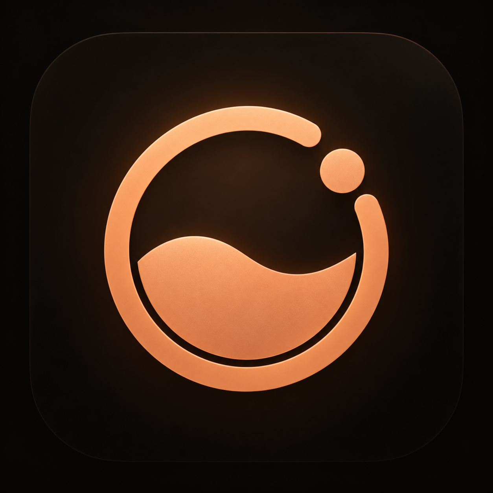

<p align="center">
  
</p>

<h1 align="center">Reflex</h1>

<p align="center">
  <strong>Routines, atomic habits, natural tasks, and deep focus — in one calm app that never leaves your phone.</strong>
</p>

<p align="center">
  <a href="https://github.com/bobby-99/reflex/releases/latest">
    
  </a>
  <a href="https://bobby-99.github.io/reflex/">
    
  </a>
  <a href="LICENSE">
    
  </a>
</p>

<p align="center">
  
  
  
  
  
  
</p>

---

## What is Reflex?

Most productivity tools demand an email, a recurring monthly subscription, and full access to your personal cloud. **Reflex requires none of them.**

Reflex is an intentional, offline-first personal operating system for Android:
- **Zero Network Permission** — The app does not declare `android.permission.INTERNET`. It is physically incapable of transmitting data off your phone.
- **Five Unified Subsystems** — Sequential timer routines, atomic habits, natural-language tasks, liquid focus timer, and unified agenda calendar.
- **Organic Design Language** — Deep obsidian canvas (`#0A0908`), warm paper light mode (`#F7F3EE`), signature metallic copper accents (`#D9A184`), locally bundled Lora typography, and floating frosted glass navigation.
- **100% Local Vault** — On-device encrypted Room SQLite v14 database with full JSON export/import, weekly WorkManager backups, and instant database wipe.

> *Built for people who want to start, focus, and finish — without handing their life over to third-party servers.*

---

## Screenshots & UI Preview

Reflex is designed with intention: warm tactile surfaces, 24dp backdrop blur, and tabular numerals (`tnum`) across all countdowns and counters.

<div align="center">
  <table style="overflow-x: auto; display: block; white-space: nowrap; border: none;">
    <tr>
      <td align="center" width="220" style="min-width: 220px; padding: 12px; vertical-align: top;">
        <br><br>
        <strong>Routines & Day Rings</strong><br>
        <sub>Sequential runner, streaks & daily progress</sub>
      </td>
      <td align="center" width="220" style="min-width: 220px; padding: 12px; vertical-align: top;">
        <br><br>
        <strong>Intelligent Tasks</strong><br>
        <sub>NLP quick capture, priority tags & FAB</sub>
      </td>
      <td align="center" width="220" style="min-width: 220px; padding: 12px; vertical-align: top;">
        <br><br>
        <strong>Deep Focus Setup</strong><br>
        <sub>Pomodoro cycles, cycle strip & steppers</sub>
      </td>
      <td align="center" width="220" style="min-width: 220px; padding: 12px; vertical-align: top;">
        <br><br>
        <strong>Liquid Wave Timer</strong><br>
        <sub>Dual-wave canvas fluid & calm quotes</sub>
      </td>
      <td align="center" width="220" style="min-width: 220px; padding: 12px; vertical-align: top;">
        <br><br>
        <strong>Atomic Habits</strong><br>
        <sub>Progress ring, steppers & streak momentum</sub>
      </td>
      <td align="center" width="220" style="min-width: 220px; padding: 12px; vertical-align: top;">
        <br><br>
        <strong>Unified Calendar</strong><br>
        <sub>Morphing month grid & "Now" timeline</sub>
      </td>
      <td align="center" width="220" style="min-width: 220px; padding: 12px; vertical-align: top;">
        <br><br>
        <strong>Settings & Vault</strong><br>
        <sub>Local profile, theme pill & diagnostics</sub>
      </td>
    </tr>
  </table>
</div>

---

## Key Systems

### ⏱️ 1. Sequential Routines Runner
- **Interval & Counter Steps**: Chain timed countdowns, simple check-offs, and repetition targets into flowing sequences.
- **Audio & Haptic Cues**: Audible completion chimes and distinct vibration pulses signal each step transition so you don't need to keep looking at your screen.
- **Foreground Service Durability**: Routine timers run in a persistent Android foreground service, surviving screen sleep and backgrounding.
- **Schedule-Aware Streaks**: Evaluates scheduled days with a 1-day grace period for missed sessions and intentional "Skip today" logging.

### ⚡ 2. Natural-Language Tasks & Floating Overlays
- **Real-Time NLP Parser**: Type natural phrases like `"Call mom tmrw 5pm !!!"` or `"Engineering sync every tuesday 9am"`. Reflex highlights parsed tokens with live copper badges as you type.
- **System-Wide Priority Alerts**: High and medium priority task reminders trigger unobtrusive floating dialogs (`SYSTEM_ALERT_WINDOW` + `showWhenLocked`) over any game, browser, or locked screen with 6-option quick snooze.
- **Interactive Checkbox Flow**: 380ms strikethrough transition before moving to completed state, backed by a 3.5-second floating Undo toast.

### 🌱 3. Atomic Habits Tracker
- **Three Core Habit Types**:
  - *Check-Off*: Binary daily completion.
  - *Measurable*: Numeric progress with custom units (e.g. `2.5L Water`, `20 Pages`) and tactile `-` / `+` circular steppers.
  - *Limit*: Maximum intake caps (e.g. `Max 2 Espressos`) with red warning indicators.
- **Streak Records & 30-Day Rate**: Tracks current streak, all-time best streak, and 30-day consistency percentage.
- **Monthly Habit Matrix**: Visual 30-day dot matrix mapping daily execution intensity.

### 🎯 4. Deep Focus Companion & Liquid Timer
- **Dual-Wave Liquid Canvas**: Dynamic sinusoidal wave engine with sloshing tilt and physical fluid draining ratio as time counts down.
- **Pomodoro & Zen Flow**: Classic Pomodoro (customizable work, short break, and long break intervals), Timed Flow, or Open Zen Flow.
- **Non-Invasive App Blocker**: Uses local `UsageStatsManager` to detect distraction apps during active focus sessions, displaying a gentle barrier to return to focus.
- **Duration Preservation**: Stopping a session early preserves actual focused minutes in Room database analytics instead of discarding progress.

### 📅 5. Unified Agenda Calendar
- **Morphing Grid Architecture**: Compact 1-row week strip that smoothly animates into a full 30-day month grid on swipe or drag.
- **Device Calendar Sync**: Live `ContentObserver` detects external calendar events across the entire device, displaying them side-by-side with Reflex tasks and routines.
- **Chronological "Now" Divider**: Anchors your position in the day between past items and upcoming agenda blocks.

---

## Quick Add Syntax Guide

Reflex parses dates, times, durations, recurrences, and priorities directly from your keyboard:

| What you type | Parsed interpretation |
| :--- | :--- |
| `today`, `tmrw`, `tonight`, `next week`, `in 5 days` | Relative calendar due dates |
| `5pm`, `17:30`, `morning`, `noon`, `eod`, `midnight` | Exact clock times and period presets |
| `in 45 mins`, `in 1hr 4min` | Relative offset duration from current time |
| `!!!` · `p1` · `urgent` · `asap` | **High priority** (triggers system overlay alert) |
| `!!` · `p2` · `med priority` | **Medium priority** (triggers system overlay alert) |
| `!` · `p3` · `low priority` | Low priority |
| `every tuesday`, `every 2 weeks`, `repeat every weekday` | Automated recurrence rules |

> **Examples:**
> - `Review pull requests tmrw 11am !!!`
> - `Engineering standup every tuesday 9am`
> - `Pick up cold brew beans today 5:30pm !!`
> - `Stretch and hydrate in 45 mins`

---

## Privacy & Permissions Transparency

Reflex requests zero trust. Each Android permission serves a strictly local capability:

| Permission | Technical Token | Plain-Language Purpose |
| :--- | :--- | :--- |
| **Notifications** | `POST_NOTIFICATIONS` | Routine step chimes, habit nudges, and active focus timer controls. |
| **Display Over Other Apps** | `SYSTEM_ALERT_WINDOW` | Full-screen priority task alerts and the focus app-blocking barrier. |
| **Usage Access** | `PACKAGE_USAGE_STATS` | On-device detection of foreground apps during active focus sessions. |
| **Device Calendar** | `READ_CALENDAR` & `WRITE_CALENDAR` | Reading device events and inserting new entries into your system calendar. |
| **Exact Alarms** | `SCHEDULE_EXACT_ALARM` | Reliable alarm scheduling that fires on time through Android Doze mode. |
| **Boot Completed** | `RECEIVE_BOOT_COMPLETED` | Re-registering your pending reminders after phone restart. |
| **Foreground Service** | `FOREGROUND_SERVICE` | Preserving countdown execution when the app is minimized. |
| **INTERNET** | *Not Declared* | **0% requested.** Physically incapable of making network connections. |

Audit the complete manifest directly: [app/src/main/AndroidManifest.xml](https://github.com/bobby-99/reflex/blob/main/app/src/main/AndroidManifest.xml).

---

## Local Development & Build

### Requirements
- **JDK 17+**
- **Android SDK** (API Level 36 / Android 16)
- **Android Studio Ladybug or newer** (recommended)

### Commands
```bash
# Clone the repository
git clone https://github.com/bobby-99/reflex.git
cd reflex

# Build debug APK and install to connected device
./gradlew installDebug

# Run unit tests and lint checks
./gradlew testDebugUnitTest lint

# Build release APK
./gradlew assembleRelease
```

---

## Architecture & Tech Stack

```
com.reflex.app/
├── ui/
│   ├── theme/           # Color.kt, Theme.kt, Type.kt (Lora serif + tnum)
│   ├── components/      # Glass tab bar, LiquidTimer, Reflex pickers, alerts
│   └── screens/         # Routines, Tasks, Focus, Habits, Calendar, Settings
├── viewmodel/           # MVVM unidirectional StateFlow contracts
├── data/
│   ├── db/              # Room Database v14 (MIGRATION_13_14)
│   ├── dao/             # TaskDao, RoutineDao, HabitDao, FocusSessionDao
│   └── repository/      # Transactional SQLite repositories & SAF managers
├── service/             # RoutineTimerService, FocusTimerService, AppBlockMonitorService
└── util/                # TaskParser (NLP), AlarmScheduler, CalendarCalculations
```

- **UI Layer**: 100% Jetpack Compose (Material 3 + bespoke Reflex tokens)
- **Backdrop Blur**: Hardware blur via [Haze](https://github.com/chrisbanes/haze) (`dev.chrisbanes.haze`)
- **Persistence**: Room SQLite v14 with WAL checkpointing + DataStore
- **Audio Engine**: Synthesized low-latency 18ms dual-resonance PCM audio (`FocusTickPlayer.kt`) & `SoundPool`
- **Background Tasks**: AndroidX WorkManager for automated weekly 7-day backups

---

## Contributing

Contributions are warmly welcomed! Please ensure:
1. **100% Offline Integrity**: Never add third-party network libraries, analytics SDKs, or cloud sync dependencies.
2. **Design System Adherence**: Follow all color, radius, and typography tokens documented in [DESIGN.md](DESIGN.md).
3. **Verified Unit Tests**: Run `./gradlew testDebugUnitTest` prior to opening pull requests.

---

## License

Reflex is free software released under the **[GNU General Public License v3.0 or later (GPL-3.0-or-later)](LICENSE)**.

<p align="center">
  <sub>Reflex — Built to help you start, focus, and finish, without handing over your data.</sub>
</p>
